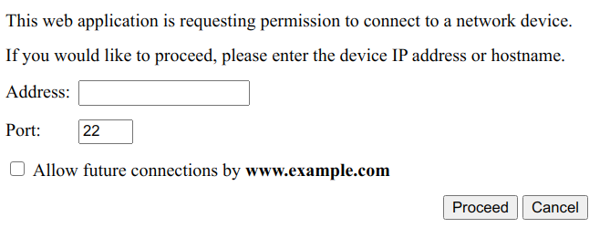

# Direct Sockets

## Background

This Network Sockets API proposal relates to the Discourse post [Filling the remaining gap between WebSocket, WebRTC and WebTransport](https://discourse.wicg.io/t/filling-the-remaining-gap-between-websocket-webrtc-and-webtranspor/4366).

## Use cases

The initial motivating use case is to support creating a web app that talks to servers and devices that have their own protocols incompatible with what’s available on the web. The web app should be able to talk to a legacy system, without requiring users to change or replace that system.

- [Secure Shell](https://en.wikipedia.org/wiki/Secure_Shell)
- [Remote Desktop Protocol](https://en.wikipedia.org/wiki/Remote_Desktop_Protocol)
- [printer protocols](https://en.wikipedia.org/wiki/List_of_printing_protocols)
- Mail
- [IRC](https://en.wikipedia.org/wiki/Internet_Relay_Chat)
- [IOT](https://en.wikipedia.org/wiki/Internet_of_things) smart devices
- [Distributed Hash Tables for P2P systems](https://discourse.wicg.io/t/filling-the-remaining-gap-between-websocket-webrtc-and-webtranspor/4366/3)
- [Resilient collaboration using IPFS](https://discourse.wicg.io/t/filling-the-remaining-gap-between-websocket-webrtc-and-webtranspor/4366/5)

## Alternatives

Web apps can already establish data communications using [XMLHttpRequest](https://xhr.spec.whatwg.org/), [WebSocket](https://html.spec.whatwg.org/multipage/web-sockets.html) and [WebRTC](https://w3c.github.io/webrtc-pc/).

These facilities are designed to be tightly constrained ([example design requirements](https://lists.w3.org/Archives/Public/public-whatwg-archive/2008Jun/0165.html)), and don't allow raw TCP or UDP communication. Such facilities were [requested](https://lists.whatwg.org/pipermail/whatwg-whatwg.org/2008-September/058530.html) but not provided due to the potential for abuse.

If the web server has network access to the required server or device, it can act as relay. For example, a web mail application might use XMLHttpRequest for communication between the browser and the web server, and use SMTP and IMAP between the web server and a mail server.

In scenarios like the following, a vendor would require their customers to deploy a relay web server on each site where devices/servers are in use:
- The target devices might be behind firewalls, not accessible to a central server.
- Communication might be bandwidth-intensive or latency-sensitive.
- There might be legal constraints on where data can be sent.
- On-site communication may need to be resilient to ISP outages.

Developers have used browser plugins - such as Java applets, ActiveX, [Adobe Flex](https://www.adobe.com/au/products/flex.html) or [Microsoft Silverlight](https://www.microsoft.com/silverlight/) - to establish raw TCP or UDP communication from the browser, without relaying through a web server.

With the shift away from browser plugins, native apps now provide the main alternative. Widely used APIs include [POSIX sockets](https://pubs.opengroup.org/onlinepubs/9699919799/basedefs/sys_socket.h.html), [Winsock](https://docs.microsoft.com/en-us/windows/win32/winsock/winsock-functions), [java.net](https://docs.oracle.com/javase/7/docs/api/java/net/package-summary.html) and [System.Net.Sockets](https://docs.microsoft.com/en-us/dotnet/api/system.net.sockets).

JavaScript APIs for socket communication have been developed for B2G OS ([TCP](https://developer.mozilla.org/en-US/docs/Archive/B2G_OS/API/TCPSocket), [UDP](https://developer.mozilla.org/en-US/docs/Archive/B2G_OS/API/UDPSocket)) and Chrome Apps ([TCP](https://developer.chrome.com/apps/sockets_tcp), [UDP](https://developer.chrome.com/apps/sockets_udp)). An earlier proposed API for the web platform is the [TCP and UDP Socket API](https://www.w3.org/TR/tcp-udp-sockets/), which the System Applications Working Group published as an informative Working Group Note and is no longer progressing.


## Initial Focus

The initial focus is on supporting connection to a single legacy server or device.

Distributed Hash Tables are not an immediate focus. The current proposal would require the user to type the address of each node, which would not be feasible for large tables.

IP multicast and UDP Broadcast are currently out of scope.

## Permissions Policy integration

This specification defines a policy-controlled permission identified by the string `direct-sockets`. Its default allowlist is `self`.

```
Permissions-Policy: direct-sockets=(self)
```

This [`Permissions-Policy`](https://chromestatus.com/feature/5745992911552512) header determines whether a `navigator.openTCPSocket({...})` or `navigator.openUDPSocket({...})` call immediately rejects with a `NotAllowedError` `DOMException`.

## Security Considerations

User agents will need to carefully consider when to make the Direct Sockets API available to web applications,
and what UI will be shown to the user.


### Threat

MITM attackers may inject sockets API calls into a web page.

#### Mitigation

The API will only available in secure contexts (HTTPS).


### Threat

A web app might initiate connections without the user realizing.

#### Mitigation

When initiating a connection, the user agent would show some UI.

The user can be asked to specify a hostname or IP address, with an option to permit future connections to this host.




### Threat

Attackers may use the API to DDOS third parties.

#### Mitigation

Connection attempts would be rate limited.

Connections will only be able to be initiated after transient activation (user interaction with the page).

No transient activation would be required for reconnections. This is important for robustness.


### Threat

Attackers may use the API to by-pass third parties' CORS policies.

#### Mitigation

We could forbid the API from being used for TCP with the well known HTTPS port, whenever the destination host supports CORS.


### Threat

Third party iframes (such as ads) might initiate connections.

#### Mitigation

A permissions policy will control access, preventing third party use by default.


### Threat

An attacker might configure DNS entries to point to private addresses in the user's intranet, tricking the user into providing access to resources behind a firewall. Such access might be used to extract information or damage hardware.

#### Mitigation

Hostnames that resolve to [non-public addresses](https://wicg.github.io/cors-rfc1918/#framework) would be rejected.
An exception is made for hostnames ending with `.local` - these are resolved using [mDNS](https://tools.ietf.org/html/rfc6762).

Thus connections to a loopback address (`127.0.0.0/8`, `::1/128`), a private network address (`10.0.0.0/8`, `172.16.0.0/12`, `192.168.0.0/16`, `fc00::/7`) or a link-local address (`169.254.0.0/16`, `fe80::/10`) will fail unless a raw IP address or a `*.local` hostname is entered by the user.

For example, if the user enters `lights.example.com` and this resolves to `192.168.12.34`, we reject the connection attempt.
If the user enters `lights.local`, and mDNS resolves this to `192.168.12.34`, the connection is allowed to proceed, just as if the user had typed `192.168.12.34`.

### Threat

Use of the API may violate organization policies, that control which protocols may be used.

#### Mitigation

User agents may restrict use of the API when enterprise software policies are in effect. For example, user agents might by default not allow use of this API unless the user has permission to install new binaries.


### Threat

MITM attackers may hijack plaintext connections created using the API.

#### Mitigation

User agents should reject connection attempts when [Content Security Policy](https://w3c.github.io/webappsec-csp/) allows the `unsafe-eval` source expression. This prevents sites from executing [eval()](https://tc39.es/ecma262/#sec-eval-x) on data retrieved using this API.

We should also facilitate use of TLS on TCP connections.

One option would be to allow TLS to be requested when opening a connection, like the [TCP and UDP Socket API](https://www.w3.org/TR/tcp-udp-sockets/)'s [useSecureTransport](https://www.w3.org/TR/tcp-udp-sockets/#widl-TCPOptions-useSecureTransport).

Another option would be to provide a method that upgrades an existing TCP connection to use TLS. Use cases would include SMTP [STARTTLS](https://tools.ietf.org/html/rfc3207#section-4), IMAP [STARTTLS](https://tools.ietf.org/html/rfc2595#section-3.1) and POP [STLS](https://tools.ietf.org/html/rfc2595#section-4).


## Privacy Considerations

If a user agent provides an option to permit future connections from an origin to specific hosts, they should provide a way for the user to clear the list of permitted destinations. The list of permitted destinations should also be cleared when the user clears data for that origin.

A user agent should not record permitted destinations if the API is used in Private Browsing modes.


## TCP

Applications will be able to request a TCP socket using a method on `navigator`:

```javascript
const options = {
    remoteAddress: 'example.com',
    remotePort: 7,
    noDelay: false,
    keepAlive: true,
    keepAliveDelay: 720_000
};
navigator.openTCPSocket(options).then(tcpSocket => { ... }).else(error => { ... });
```

The `remoteAddress` member may be omitted or ignored - the user agent may invite the user to specify the address.

There is currently no provision for setting the local address or port.

The TCP socket can be used for reading and writing:

```
let readableStream = tcpSocket.readable;
let writableStream = tcpSocket.writable;
...
tcpSocket.close();
```

To simplify security analysis, an API for listening for incoming connections is not yet being proposed.

## UDP

To simplify security analysis, the initial proposal only supports cases where the web app initiates communication with a remote host.

Received packets will only be routed if they came from the remote address and port used when opening the socket. Other packets will be dropped silently.


```
const options = {
    remoteAddress: 'example.com',
    remotePort: 7
};

try {
  const udpSocket = await navigator.openUDPSocket(options);
  doStuffWith(udpSocket);
  ...
} catch (err) {
  // handle error
} finally {
  udpSocket.close();
}
```

The `remoteAddress` member may be omitted or ignored - the user agent may invite the user to specify the address.

There is currently no provision for setting the local address or port.

`send` returns a promise, that resolves if the message is sent, and rejects otherwise.

```
let blob = ...;
await udpSocket.send(blob);
```

The UDP socket is `async iterable`, so we can asynchronously iterate to read incoming messages:

```
for await (let [source, blob] of udpSocket) {
  console.log('Received ' + blob.size + ' bytes from ' + source.remoteAddress);
}
```

